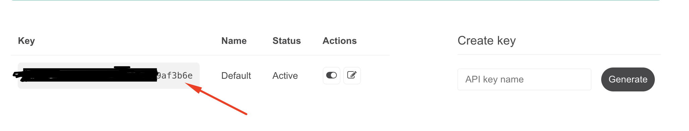
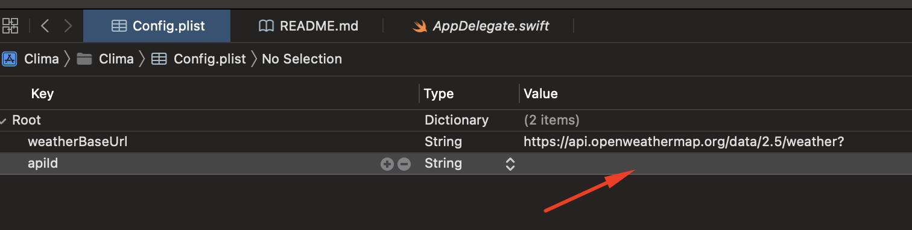

#  Установка
1. Необходимо зарегистрироваться на сайте [OpenWeather](https://home.openweathermap.org/) и в личном кабинете создать API ключ (для работы приложения достаточно бесплатного аккаунта):

2. Скопировать полученный ключ из п.1 и вставить в Config.plist в поле apiId:

3. Ура! Можно запускать приложение.

#  О приложении
Это простое погодное приложение, которое получает необходимую информацию с сайта [OpenWeather](https://home.openweathermap.org/).

Чтобы получить информацию о погоде, достаточно вбить в поисковую строку название города и нажать кнопку поиска:

Также можно узнать погоду по текущей геолокации. Для этого необходимо кликнуть на кнопку с навигацией (при первом запуске приложение запросит разрешение на доступ к геолокационным данным пользователя):

